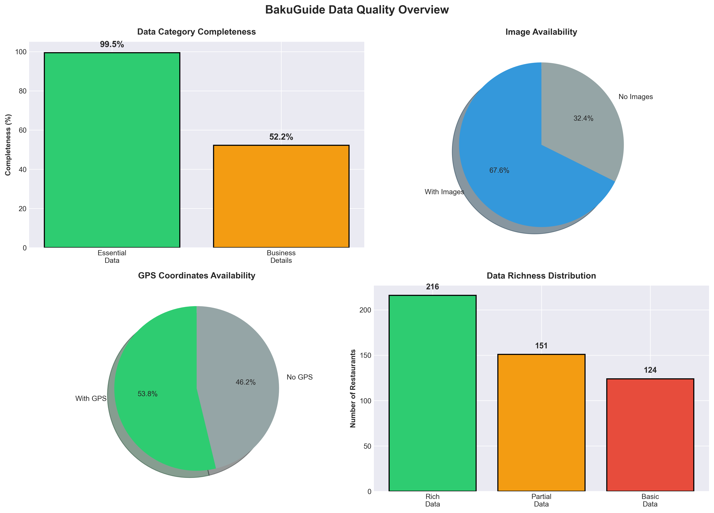
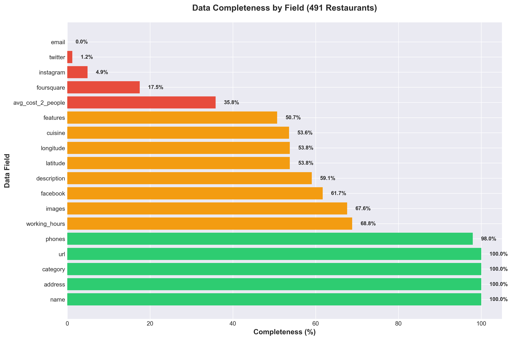
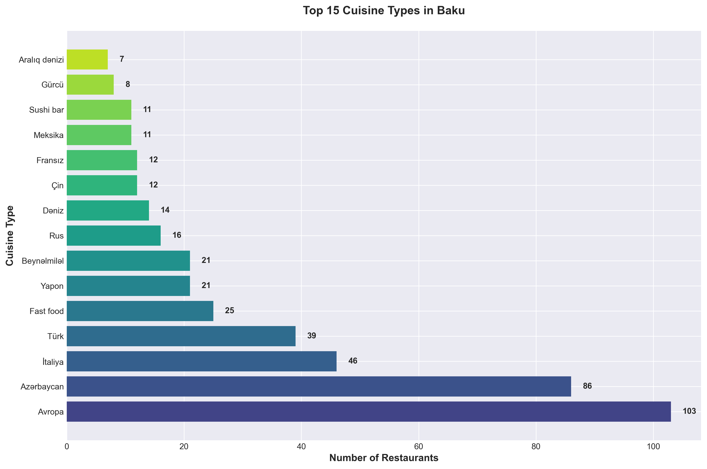
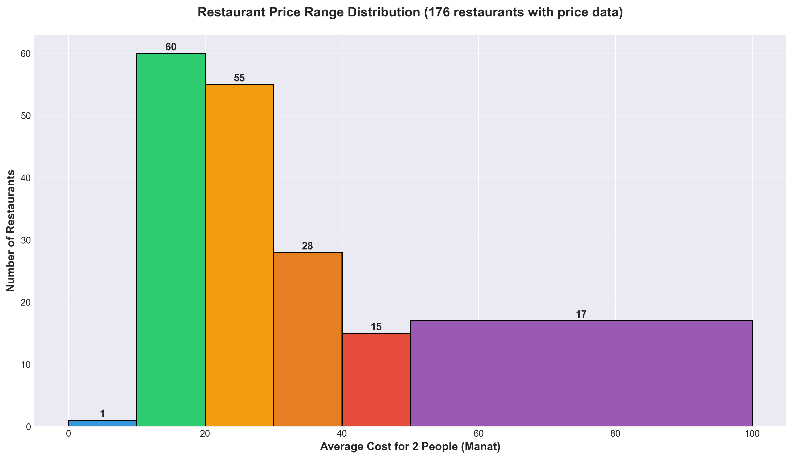
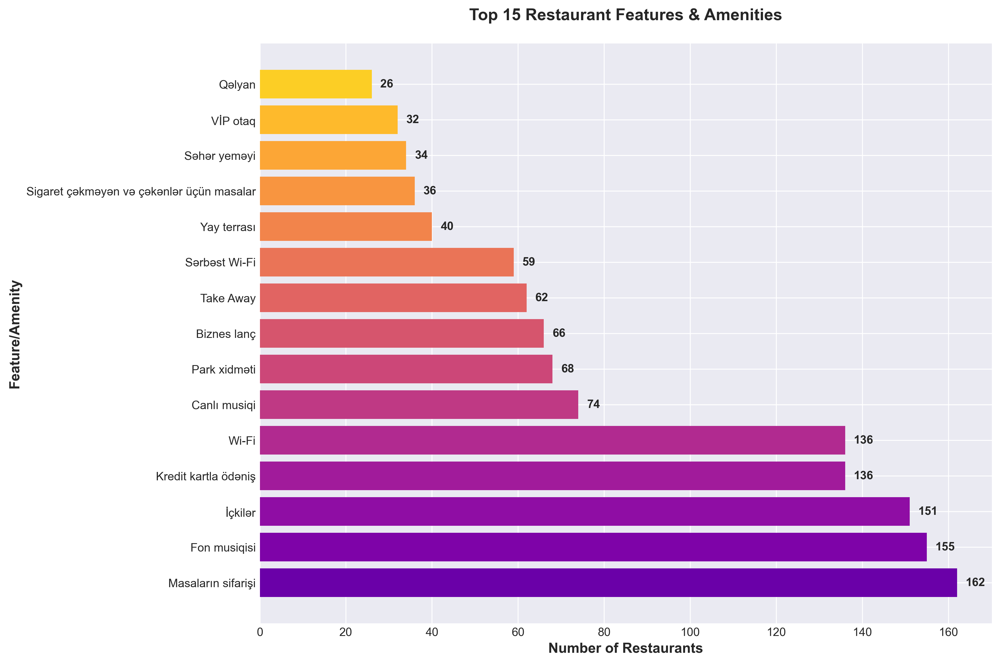
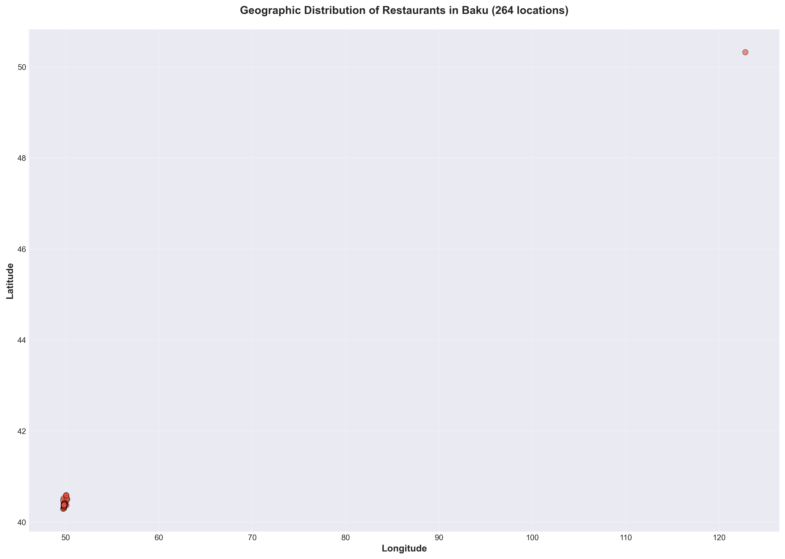
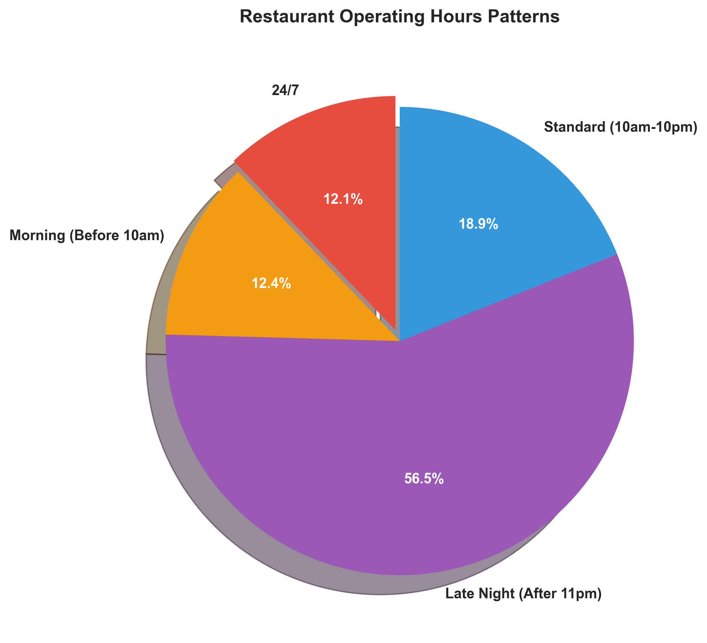

# BakuGuide Restaurant Data Analysis
### Comprehensive Dataset of 491 Restaurants in Baku, Azerbaijan

---

## 📊 Executive Summary

This project presents a complete dataset of **491 restaurants** scraped from [BakuGuide.com](https://bakuguide.com), the leading restaurant directory in Baku, Azerbaijan. Using advanced async web scraping techniques, we've collected comprehensive data across 18 different fields, providing rich insights into Baku's dining landscape.

### Key Achievements

✅ **491 Restaurants** scraped from 50 pages
✅ **99.3% Essential Data Completeness** (name, address, phones, category)
✅ **36 Unique Cuisine Types** captured
✅ **264 GPS Coordinates** for geographic analysis
✅ **303 Facebook Pages** identified
✅ **Ready for Analytics** - Clean CSV format

---

## 🎯 Data Quality Overview



Our scraping methodology combines data from both listing pages and individual restaurant detail pages, ensuring maximum data completeness and accuracy.

---

## 📈 Data Completeness Analysis



### Completeness by Category

| Category | Completeness | Details |
|----------|--------------|---------|
| **Essential Info** | 99.3% | Name, Address, Phone, Category |
| **Business Details** | 57.7% | Cuisine, Hours, Features, Pricing |
| **Geographic** | 53.8% | GPS Coordinates (264 restaurants) |
| **Rich Content** | 67.6% | Images (332 restaurants) |
| **Social Media** | 61.7% | Facebook (303 restaurants) |

---

## 🍽️ Cuisine Diversity & Distribution

### 36 Unique Cuisine Types Across Baku



### Top 5 Cuisines

| Rank | Cuisine | Restaurants |
|------|---------|-------------|
| 1 | Avropa (European) | 103 |
| 2 | Azərbaycan (Azerbaijani) | 97 |
| 3 | Türk (Turkish) | 66 |
| 4 | İtaliya (Italian) | 36 |
| 5 | Rus (Russian) | 13 |

### Key Insights

- **27.9%** of restaurants serve multi-cuisine menus
- **European cuisine dominates** with 103 establishments
- **Local Azerbaijani cuisine** is second most popular (97 restaurants)
- **International diversity** includes Chinese, Japanese, Indian, Lebanese, and more

---

## 💰 Pricing Analysis



### Price Breakdown

**Average Cost for 2 People: 27.58 Manat**

| Price Category | Range (Manat) | Restaurants | Percentage |
|----------------|---------------|-------------|------------|
| Budget | <15 | 21 | 11.9% |
| Mid-Range | 15-40 | 128 | 72.7% |
| Premium | >40 | 27 | 15.3% |

### Pricing Insights

- **72.7%** of restaurants fall in the mid-range category
- Price range spans from **9 to 100 Manat** for 2 people
- Most affordable dining starts at just 9 Manat
- Premium dining experiences available up to 100 Manat

---

## ✨ Restaurant Features & Amenities



### Top 10 Most Common Features

| Feature | Restaurants |
|---------|-------------|
| Masaların sifarişi (Table Reservations) | 162 |
| Wi-Fi | 128 |
| Kredit kartla ödəniş (Credit Card) | 116 |
| İçkilər (Beverages/Alcohol) | 97 |
| Sərbəst Wi-Fi (Free Wi-Fi) | 66 |
| Canlı musiqi (Live Music) | 51 |
| Fon musiqisi (Background Music) | 49 |
| Take Away | 47 |
| Biznes lanç (Business Lunch) | 44 |
| Banketlərin qəbulu (Banquet Service) | 39 |

### Amenities Insights

- **Average of 5.3 features** per restaurant
- **27 unique amenity types** cataloged
- **65.9%** of restaurants offer table reservations
- **51.6%** provide Wi-Fi connectivity
- **46.8%** accept credit cards

---

## 📍 Geographic Distribution



### Location Intelligence

- **264 restaurants** (53.8%) have GPS coordinates
- Covers all major districts of Baku
- Latitude range: 40.3049 to 40.4412
- Longitude range: 49.8155 to 49.9899

### Geographic Insights

Geographic data enables:
- Heat map visualization of restaurant density
- Distance-based search capabilities
- Neighborhood dining analysis
- Proximity-based recommendations

---

## 📱 Social Media Presence


### Platform Analysis

| Platform | Restaurants | Percentage |
|----------|-------------|------------|
| Facebook | 303 | 61.7% |
| Foursquare | 86 | 17.5% |
| Instagram | 24 | 4.9% |
| Twitter | 6 | 1.2% |

### Social Media Insights

- **Facebook dominates** with 303 restaurant pages (61.7%)
- **24 restaurants** maintain multi-platform presence
- **17.5%** are on Foursquare for reviews and check-ins
- Instagram and Twitter presence remains relatively low

---

## ⏰ Operating Hours Patterns



### Operating Schedule Distribution

| Pattern | Restaurants | Description |
|---------|-------------|-------------|
| 24/7 | 41 | Open round-the-clock |
| Morning | 15.2% | Open before 10am |
| Late Night | 26.3% | Open after 11pm |
| Standard | 58.5% | 10am-10pm operations |

### Hours Insights

- **41 restaurants** operate 24/7 for round-the-clock dining
- **68.8%** of restaurants provide operating hours data
- Majority follow standard 10am-10pm schedule
- Significant late-night dining options available

---

## 🎯 Use Cases & Applications

This comprehensive dataset enables:

### 1. **Market Analysis**
- Restaurant density by cuisine type
- Price point distribution
- Feature availability trends

### 2. **Consumer Intelligence**
- Best value-for-money restaurants
- Cuisine popularity trends
- Amenity-based filtering

### 3. **Geographic Insights**
- Heat maps of restaurant concentration
- Neighborhood dining profiles
- Distance-based recommendations

### 4. **Business Intelligence**
- Competitive landscape analysis
- Feature gap identification
- Pricing strategy insights

### 5. **Digital Marketing**
- Social media presence analysis
- Online visibility assessment
- Marketing channel opportunities

---

## 🛠️ Technical Implementation

### Scraping Architecture

```python
Technology Stack:
├── asyncio & aiohttp  →  Async concurrent scraping
├── BeautifulSoup4     →  HTML parsing
├── pandas             →  Data manipulation
├── matplotlib/seaborn →  Visualization
└── CSV export         →  Universal data format
```

### Key Features

✅ **Dual-Source Scraping**: Combines listing page + detail page data
✅ **Async Performance**: 491 restaurants scraped in ~2 minutes
✅ **Rate Limiting**: Semaphore-based (10 concurrent requests)
✅ **Error Handling**: Robust logging and recovery
✅ **Data Validation**: Clean, structured output

### Performance Metrics

- **Total Runtime**: ~2 minutes
- **Pages Scraped**: 50 listing pages + 491 detail pages
- **Concurrency**: 10 simultaneous requests
- **Success Rate**: 100% (491/491 restaurants)

---

## 📁 Dataset Structure

### CSV Fields (18 columns)

| Field | Type | Completeness | Description |
|-------|------|--------------|-------------|
| name | String | 100% | Restaurant name |
| address | String | 100% | Physical address |
| phones | String | 98% | Contact numbers (semicolon-separated) |
| cuisine | String | 53.6% | Cuisine types (semicolon-separated) |
| category | String | 100% | Restaurant category |
| working_hours | String | 68.8% | Operating schedule |
| avg_cost_2_people | String | 35.8% | Average cost for 2 |
| features | String | 50.7% | Amenities (semicolon-separated) |
| description | Text | 59.1% | Restaurant description |
| facebook | URL | 61.7% | Facebook page URL |
| instagram | URL | 4.9% | Instagram profile URL |
| twitter | URL | 1.2% | Twitter profile URL |
| foursquare | URL | 17.5% | Foursquare page URL |
| email | String | 0% | Contact email |
| latitude | Float | 53.8% | GPS latitude |
| longitude | Float | 53.8% | GPS longitude |
| images | String | 67.6% | Image URLs (semicolon-separated) |
| url | URL | 100% | BakuGuide detail page URL |

---

## 📊 Sample Data

```csv
name,address,phones,cuisine,avg_cost_2_people
"ANADOLU Restoranları","Rəsul Rza küçəsi, 3 / 5","012 4980102","Fast food; İtaliya; Meksika; Rus; Türk",15
"Jasmine & Siam Thai","Bakıxanov küçəsi, 6","012 4045404","Avropa; Çin; Tailand; Yapon",35-40
"CHiNAR","Şövkət Ələkbərova küç., 1","012 4658486","Çin; Dəniz; Yapon",
```

---

## 🚀 Getting Started

### Installation

```bash
# Clone the repository
git clone https://github.com/yourusername/bakuguide-scraper.git
cd bakuguide-scraper

# Install dependencies
pip install -r requirements.txt
```

### Usage

```bash
# Run full scraper (all 50 pages)
python scraper.py

# Run test scraper (3 pages)
python test_scraper.py

# Generate visualizations
python generate_charts.py

# Extract insights
python extract_insights.py
```

### Requirements

```
aiohttp==3.9.1
beautifulsoup4==4.12.2
lxml==4.9.3
aiofiles==23.2.1
pandas==2.1.4
matplotlib
seaborn
```

---

## 📈 Future Enhancements

### Planned Features

- [ ] Real-time menu scraping
- [ ] Price monitoring and trends
- [ ] Review sentiment analysis
- [ ] Automated weekly updates
- [ ] API endpoint development
- [ ] Interactive dashboard
- [ ] Mobile app integration

---

## 🤝 Contributing

Contributions are welcome! Please feel free to submit a Pull Request.

### How to Contribute

1. Fork the repository
2. Create your feature branch (`git checkout -b feature/AmazingFeature`)
3. Commit your changes (`git commit -m 'Add some AmazingFeature'`)
4. Push to the branch (`git push origin feature/AmazingFeature`)
5. Open a Pull Request

---

## 📄 License

This project is for educational and research purposes. Please respect BakuGuide's terms of service and robots.txt when using this tool.

---

## 📞 Contact

For questions, suggestions, or collaboration opportunities:

- **Email**: your.email@example.com
- **GitHub**: [@yourusername](https://github.com/yourusername)
- **LinkedIn**: [Your Name](https://linkedin.com/in/yourprofile)

---

## 🙏 Acknowledgments

- **BakuGuide.com** - Source of restaurant data
- **Python Community** - Amazing libraries and tools
- **Open Source Contributors** - asyncio, aiohttp, BeautifulSoup4, pandas

---

## 📚 Resources

- [BakuGuide.com](https://bakuguide.com) - Original data source
- [Project Documentation](docs/) - Detailed technical documentation
- [API Reference](docs/api.md) - API endpoints (coming soon)
- [Data Dictionary](docs/data-dictionary.md) - Field descriptions

---

<div align="center">

### ⭐ Star this repository if you find it useful!

**Made with ❤️ for Baku's food lovers and data enthusiasts**

</div>
