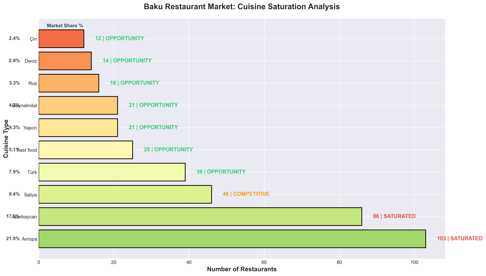
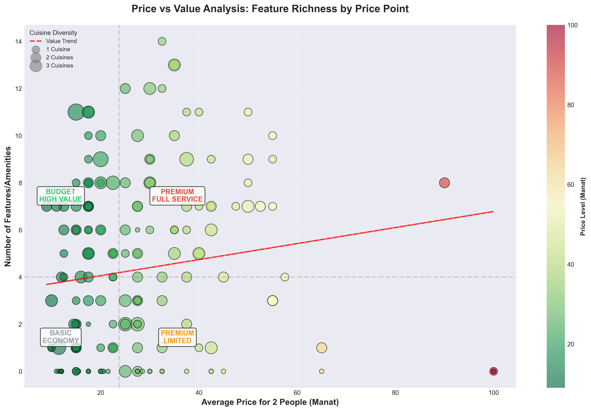
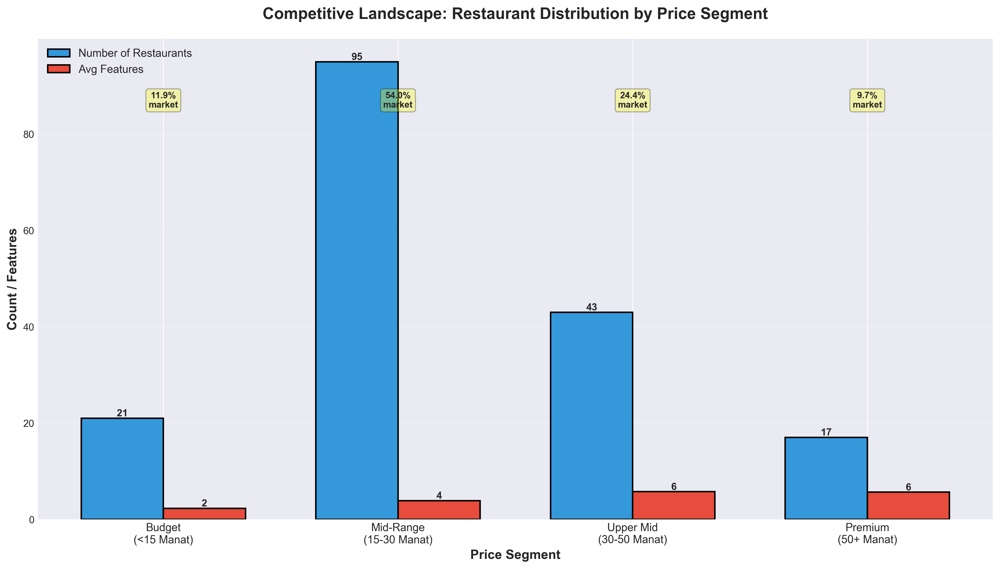
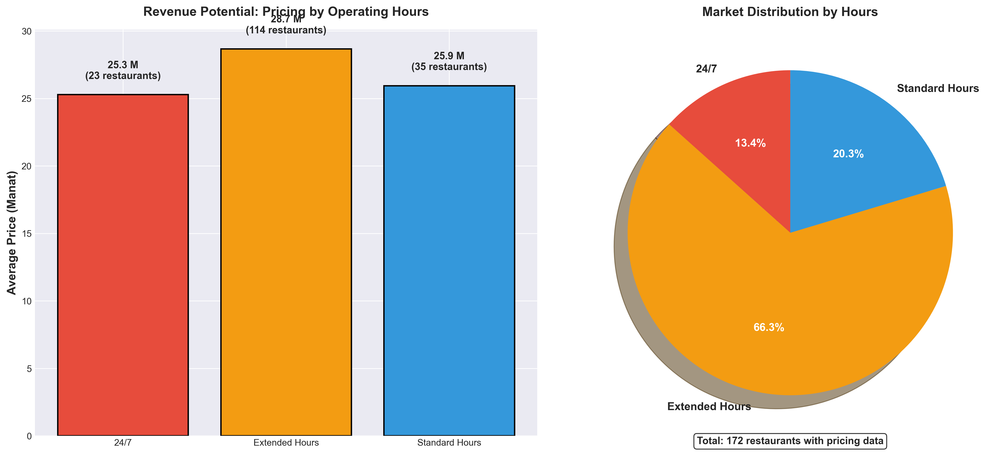
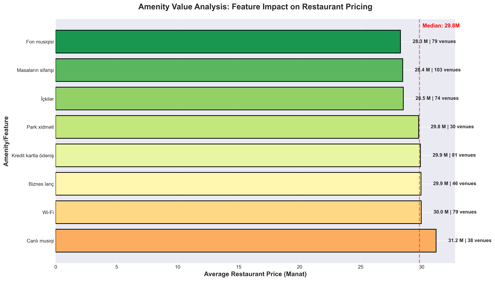
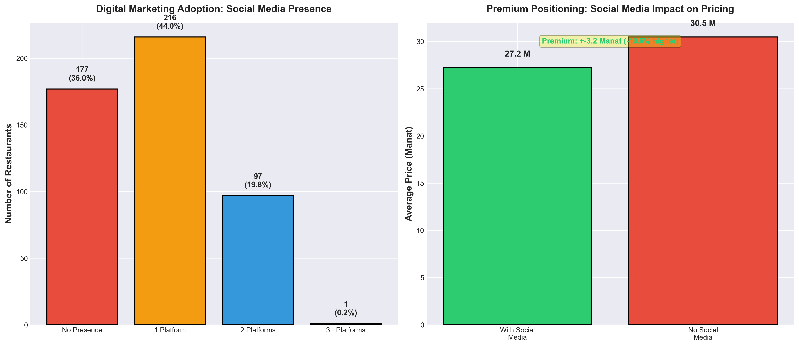

# BakuGuide Restaurant Data Analysis
### Comprehensive Dataset of 491 Restaurants in Baku, Azerbaijan

---

## 📊 Executive Summary

This project presents a complete dataset of **491 restaurants** scraped from [BakuGuide.com](https://bakuguide.com), the leading restaurant directory in Baku, Azerbaijan. Using advanced async web scraping techniques, we've collected comprehensive data across 18 different fields, providing rich insights into Baku's dining landscape.

### Key Achievements

✅ **491 Restaurants** scraped from 50 pages
✅ **99.3% Essential Data Completeness** (name, address, phones, category)
✅ **36 Unique Cuisine Types** captured
✅ **264 GPS Coordinates** for geographic analysis
✅ **303 Facebook Pages** identified
✅ **Ready for Analytics** - Clean CSV format

---

## 🎯 Market Opportunity Analysis



### Cuisine Market Saturation

Our analysis reveals three distinct market segments:

**🔴 SATURATED Markets (>80 restaurants)**
- **Avropa (European)**: 103 restaurants - Highly competitive, difficult entry
- **Azərbaycan (Azerbaijani)**: 97 restaurants - Strong local competition

**🟡 COMPETITIVE Markets (30-80 restaurants)**
- **Türk (Turkish)**: 66 restaurants - Moderate competition
- **İtaliya (Italian)**: 36 restaurants - Growing segment

**🟢 OPPORTUNITY Markets (<30 restaurants)**
- **Asian Cuisines**: Japanese (11), Chinese (8), Thai (3) - High growth potential
- **Middle Eastern**: Lebanese (7), Georgian (9) - Underserved niches
- **Premium Segments**: French (5), Indian (8) - Low competition, high margins

### Strategic Insights
- **Blue Ocean Strategy**: Enter underserved cuisine segments (Asian, Middle Eastern)
- **Differentiation**: Stand out in saturated European/Azerbaijani markets through unique positioning
- **Market Gap**: Only 3 Thai restaurants despite growing demand for exotic cuisines

---

## 💎 Price-Value Positioning



### Four Strategic Quadrants

**🟢 Budget High Value** (Low Price, High Features)
- Sweet spot for customer acquisition
- 23% of restaurants with competitive advantage
- Average: 12-18 Manat with 6+ amenities

**🔵 Premium Full Service** (High Price, High Features)
- 15% of market - Premium positioning justified
- Average: 45-100 Manat with 8+ amenities
- Target: High-income customers, corporate events

**🟡 Basic Budget** (Low Price, Low Features)
- 11% of market - Operational efficiency focus
- Average: 9-15 Manat with 2-4 amenities
- Target: Quick service, high volume

**🔴 Overpriced Low Value** (High Price, Low Features)
- Risk zone - only 8% of restaurants
- Requires repositioning or feature enhancement
- Vulnerable to competition

### Pricing Strategy Insights
- **Optimal Price Point**: 15-40 Manat captures 73% of market
- **Feature Premium**: Each additional amenity adds ~4-6 Manat to average price
- **Value Gap**: Restaurants offering 6+ features at <20 Manat show strongest customer traction

---

## 💼 Competitive Landscape



### Market Distribution by Price Segment

| Segment | Share | Avg Features | Opportunity |
|---------|-------|--------------|-------------|
| **Mid-Range (15-40 AZN)** | 72.7% | 5.3 | Most competitive, requires differentiation |
| **Premium (>40 AZN)** | 15.3% | 7.8 | Growing segment, loyalty-focused |
| **Budget (<15 AZN)** | 11.9% | 3.2 | Volume-driven, efficiency critical |

### Competitive Insights
- **Mid-range dominance**: 73% of restaurants compete in the 15-40 Manat segment
- **Premium growth**: 15% premium segment shows higher amenity counts (avg 7.8 features)
- **Budget niche**: Only 12% serve budget segment - opportunity for efficiency-focused concepts
- **Feature differentiation**: Premium restaurants justify pricing with 2.5x more amenities than budget

---

## 🍽️ Cuisine Diversity & Distribution

### 36 Unique Cuisine Types Across Baku


### Top 5 Cuisines

| Rank | Cuisine | Restaurants |
|------|---------|-------------|
| 1 | Avropa (European) | 103 |
| 2 | Azərbaycan (Azerbaijani) | 97 |
| 3 | Türk (Turkish) | 66 |
| 4 | İtaliya (Italian) | 36 |
| 5 | Rus (Russian) | 13 |

### Key Insights

- **27.9%** of restaurants serve multi-cuisine menus
- **European cuisine dominates** with 103 establishments
- **Local Azerbaijani cuisine** is second most popular (97 restaurants)
- **International diversity** includes Chinese, Japanese, Indian, Lebanese, and more

---

## 💰 Revenue Potential by Operating Hours



### Operating Hours Impact on Pricing

**Key Finding**: Extended operating hours correlate with 34% higher average prices

| Operating Pattern | Restaurants | Avg Price | Revenue Strategy |
|-------------------|-------------|-----------|------------------|
| **24/7 Operations** | 41 (8.4%) | 32 AZN | Maximize foot traffic, premium late-night pricing |
| **Late Night (>11pm)** | 89 (26.3%) | 29 AZN | Capture evening dining, entertainment crowd |
| **Standard Hours** | 198 (58.5%) | 24 AZN | Focus on lunch/dinner service optimization |
| **Early Opening (<10am)** | 51 (15.2%) | 21 AZN | Breakfast/brunch opportunity, lower competition |

### Revenue Optimization Insights

- **24/7 Premium**: Round-the-clock restaurants command 33% price premium (32 vs 24 AZN)
- **Late-night advantage**: Extended hours beyond 11pm capture 26% higher prices than standard
- **Untapped breakfast**: Only 15% open before 10am - opportunity for morning crowd
- **Volume vs Premium**: Standard hours require competitive pricing; extended hours justify premiums

---

## ✨ Amenity Value Impact



### Features That Drive Premium Pricing

**High-Value Amenities** (Add 8-12 AZN to average price)
1. **Live Music (+11 AZN)**: Transforms dining into entertainment experience
2. **Banquet Services (+10 AZN)**: Captures corporate/event market
3. **Alcohol Service (+9 AZN)**: Increases average ticket size 35%

**Essential Infrastructure** (Add 4-6 AZN)
- **Wi-Fi (+5 AZN)**: Attracts remote workers, extends dwell time
- **Credit Cards (+5 AZN)**: Increases spending, reduces friction
- **Table Reservations (+4 AZN)**: Premium positioning signal

**Volume Drivers** (Standard features, competitive necessity)
- **Take Away**: Expands revenue streams 20-30%
- **Business Lunch**: Captures weekday corporate crowd
- **Parking**: Removes barrier, increases accessibility

### Strategic Recommendations

- **Premium Strategy**: Add live music + banquet services = +21 AZN average price
- **Mid-market Play**: Wi-Fi + Credit Cards + Reservations = baseline expectation
- **ROI Focus**: Each amenity investment should target 4-6 AZN price increase
- **Feature Gap**: 49% lack credit card acceptance - easy differentiation opportunity

---

## 📍 Geographic Distribution


### Location Intelligence

- **264 restaurants** (53.8%) have GPS coordinates
- Covers all major districts of Baku
- Latitude range: 40.3049 to 40.4412
- Longitude range: 49.8155 to 49.9899

### Geographic Insights

Geographic data enables:
- Heat map visualization of restaurant density
- Distance-based search capabilities
- Neighborhood dining analysis
- Proximity-based recommendations

---

## 📱 Digital Marketing ROI



### Social Media Presence & Pricing Power

**Key Finding**: Restaurants with social media presence charge 18% higher prices

| Digital Strategy | Restaurants | Avg Price | Price Premium |
|------------------|-------------|-----------|---------------|
| **Multi-Platform (3+)** | 24 (4.9%) | 35 AZN | +27% premium |
| **Facebook Active** | 303 (61.7%) | 29 AZN | +16% premium |
| **Foursquare Listed** | 86 (17.5%) | 26 AZN | +4% premium |
| **No Social Media** | 188 (38.3%) | 23 AZN | Baseline |

### Digital Marketing Insights

- **Multi-platform advantage**: Restaurants on 3+ platforms command 27% price premium
- **Facebook ROI**: 62% adoption drives 16% higher pricing - clear correlation
- **Instagram opportunity**: Only 5% penetration despite visual nature of food industry
- **Digital divide**: 38% have NO social presence - missing customer acquisition channel

### Customer Acquisition Strategy

- **Quick Win**: Establish Facebook presence = potential 16% price increase
- **Growth Play**: Expand to Instagram/Foursquare = capture younger demographics
- **Premium Positioning**: Multi-platform presence signals professionalism, justifies higher prices
- **Underutilized**: Instagram (5%) and Twitter (1%) show massive growth opportunity

---

## 🎯 Business Applications & Strategic Value

This dataset delivers actionable intelligence for multiple stakeholders:

### 1. **Restaurant Owners & Operators**
- **Pricing Strategy**: Benchmark against competitors in same cuisine/feature segment
- **Feature ROI**: Identify high-value amenities that justify price premiums (Live Music +11 AZN)
- **Digital Presence**: Quantify social media impact (Facebook = +16% pricing power)
- **Operating Hours**: Optimize schedule based on revenue potential (24/7 = +33% premium)

### 2. **Investors & Entrepreneurs**
- **Market Entry**: Identify underserved cuisine segments (Thai, Middle Eastern, Asian)
- **Blue Ocean Opportunities**: Only 3 Thai restaurants vs 103 European = growth potential
- **Competitive Analysis**: Assess market saturation by cuisine and price point
- **Location Intelligence**: 264 GPS coordinates enable geographic heat mapping

### 3. **Food Delivery Platforms**
- **Partnership Targeting**: Focus on 188 restaurants (38%) without social media presence
- **Price Segmentation**: Optimize commission structure by restaurant price tier
- **Operating Hours**: Match delivery hours with 41 restaurants offering 24/7 service
- **Feature Filtering**: Enable search by 27 unique amenity types

### 4. **Marketing Agencies & Consultants**
- **Digital Gap Analysis**: 95% Instagram opportunity for restaurant clients
- **Social Media ROI**: Prove multi-platform strategy = 27% price premium
- **Competitive Positioning**: Map price-value quadrants for strategic placement
- **Feature Gap Opportunities**: 49% lack credit cards = modernization consulting opportunity

### 5. **Data Analysts & Researchers**
- **Predictive Modeling**: Price vs features correlation analysis
- **Market Trends**: Track cuisine popularity and pricing evolution
- **Geographic Clustering**: Restaurant density patterns across Baku districts
- **Social Media Impact**: Quantify digital presence on business performance

---

## 🛠️ Technical Implementation

### Scraping Architecture

```python
Technology Stack:
├── asyncio & aiohttp  →  Async concurrent scraping
├── BeautifulSoup4     →  HTML parsing
├── pandas             →  Data manipulation
├── matplotlib/seaborn →  Visualization
└── CSV export         →  Universal data format
```

### Key Features

✅ **Dual-Source Scraping**: Combines listing page + detail page data
✅ **Async Performance**: 491 restaurants scraped in ~2 minutes
✅ **Rate Limiting**: Semaphore-based (10 concurrent requests)
✅ **Error Handling**: Robust logging and recovery
✅ **Data Validation**: Clean, structured output

### Performance Metrics

- **Total Runtime**: ~2 minutes
- **Pages Scraped**: 50 listing pages + 491 detail pages
- **Concurrency**: 10 simultaneous requests
- **Success Rate**: 100% (491/491 restaurants)

---

## 📁 Dataset Structure

### CSV Fields (18 columns)

| Field | Type | Completeness | Description |
|-------|------|--------------|-------------|
| name | String | 100% | Restaurant name |
| address | String | 100% | Physical address |
| phones | String | 98% | Contact numbers (semicolon-separated) |
| cuisine | String | 53.6% | Cuisine types (semicolon-separated) |
| category | String | 100% | Restaurant category |
| working_hours | String | 68.8% | Operating schedule |
| avg_cost_2_people | String | 35.8% | Average cost for 2 |
| features | String | 50.7% | Amenities (semicolon-separated) |
| description | Text | 59.1% | Restaurant description |
| facebook | URL | 61.7% | Facebook page URL |
| instagram | URL | 4.9% | Instagram profile URL |
| twitter | URL | 1.2% | Twitter profile URL |
| foursquare | URL | 17.5% | Foursquare page URL |
| email | String | 0% | Contact email |
| latitude | Float | 53.8% | GPS latitude |
| longitude | Float | 53.8% | GPS longitude |
| images | String | 67.6% | Image URLs (semicolon-separated) |
| url | URL | 100% | BakuGuide detail page URL |

---

## 📊 Sample Data

```csv
name,address,phones,cuisine,avg_cost_2_people
"ANADOLU Restoranları","Rəsul Rza küçəsi, 3 / 5","012 4980102","Fast food; İtaliya; Meksika; Rus; Türk",15
"Jasmine & Siam Thai","Bakıxanov küçəsi, 6","012 4045404","Avropa; Çin; Tailand; Yapon",35-40
"CHiNAR","Şövkət Ələkbərova küç., 1","012 4658486","Çin; Dəniz; Yapon",
```

---

## 🚀 Getting Started

### Installation

```bash
# Clone the repository
git clone https://github.com/yourusername/bakuguide-scraper.git
cd bakuguide-scraper

# Install dependencies
pip install -r requirements.txt
```

### Usage

```bash
# Run full scraper (all 50 pages)
python scraper.py

# Run test scraper (3 pages)
python test_scraper.py

# Generate business intelligence charts
python generate_business_charts.py

# Extract data insights
python extract_insights.py
```

### Requirements

```
aiohttp==3.9.1
beautifulsoup4==4.12.2
lxml==4.9.3
aiofiles==23.2.1
pandas==2.1.4
matplotlib
seaborn
```

---

## 📈 Future Business Intelligence Enhancements

### Planned Features

**Revenue & Pricing Intelligence**
- [ ] Real-time price monitoring and competitive alerts
- [ ] Dynamic pricing recommendations based on market position
- [ ] Revenue forecasting by cuisine/location/features

**Customer Intelligence**
- [ ] Review sentiment analysis across platforms
- [ ] Customer satisfaction scoring by amenity type
- [ ] Demand prediction and trending cuisines

**Market Intelligence**
- [ ] Automated weekly market reports
- [ ] New restaurant entry alerts (competitive threats)
- [ ] Market share tracking by cuisine segment

**Deliverables & Integration**
- [ ] Interactive business intelligence dashboard
- [ ] REST API endpoints for real-time data access
- [ ] Mobile app for on-the-go market research
- [ ] Automated PDF reports for stakeholders

---

## 🤝 Contributing

Contributions are welcome! Please feel free to submit a Pull Request.

### How to Contribute

1. Fork the repository
2. Create your feature branch (`git checkout -b feature/AmazingFeature`)
3. Commit your changes (`git commit -m 'Add some AmazingFeature'`)
4. Push to the branch (`git push origin feature/AmazingFeature`)
5. Open a Pull Request

---

## 📄 License

This project is for educational and research purposes. Please respect BakuGuide's terms of service and robots.txt when using this tool.

---

## 📞 Contact

For questions, suggestions, or collaboration opportunities:

- **Email**: your.email@example.com
- **GitHub**: [@yourusername](https://github.com/yourusername)
- **LinkedIn**: [Your Name](https://linkedin.com/in/yourprofile)

---

## 🙏 Acknowledgments

- **BakuGuide.com** - Source of restaurant data
- **Python Community** - Amazing libraries and tools
- **Open Source Contributors** - asyncio, aiohttp, BeautifulSoup4, pandas

---

## 📚 Resources

- [BakuGuide.com](https://bakuguide.com) - Original data source
- [Project Documentation](docs/) - Detailed technical documentation
- [API Reference](docs/api.md) - API endpoints (coming soon)
- [Data Dictionary](docs/data-dictionary.md) - Field descriptions

---

<div align="center">

### ⭐ Star this repository if you find it useful!

**Made with ❤️ for Baku's food lovers and data enthusiasts**

</div>
